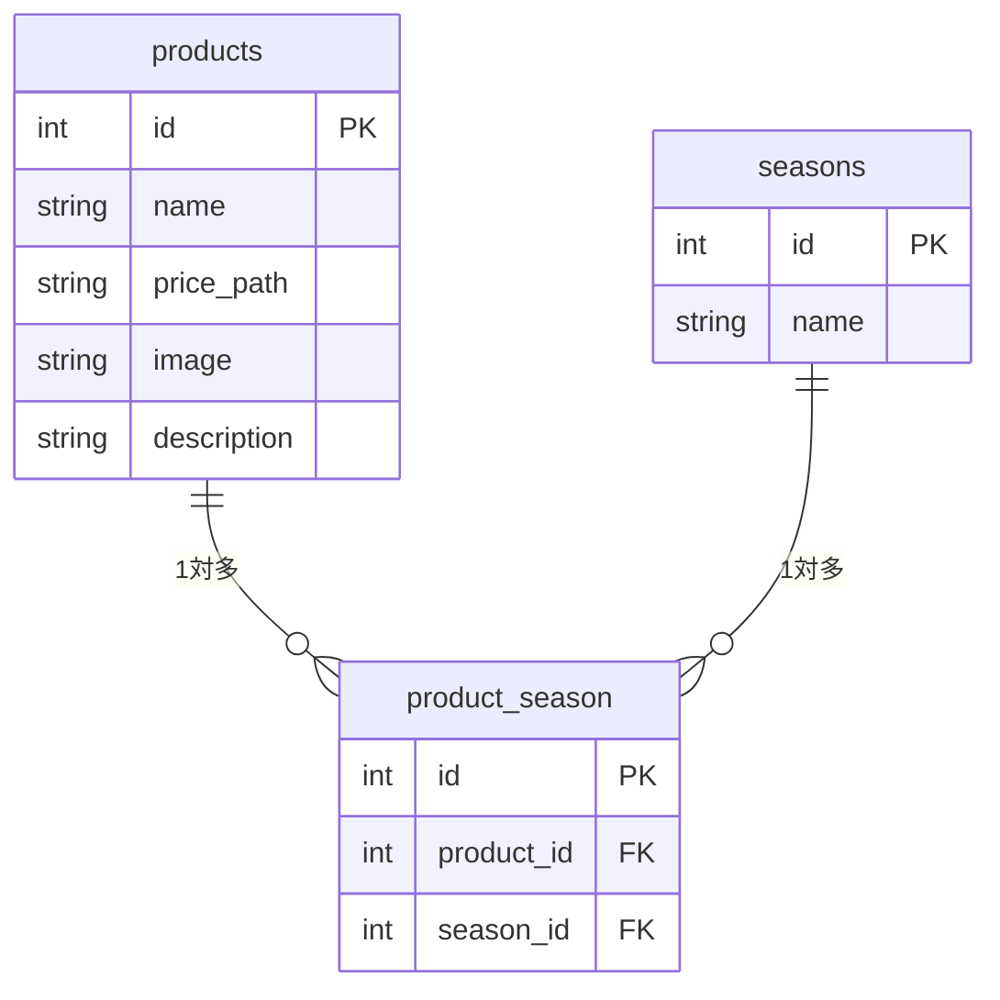

## ER図

flowchart TD

    A[PG01 商品一覧 /products] -->|商品をクリック| B[PG02 商品詳細 /products/detail/{id}]
    A -->|新規登録ボタン| D[PG04 商品登録 /products/register]
    A -->|検索フォーム| E[PG05 検索 /products/search]

    B -->|編集ボタン| C[PG03 商品更新 /products/{id}/update]
    B -->|削除ボタン| F[PG06 削除 /products/{id}/delete]
    B -->|一覧へ戻る| A

    C -->|更新完了後| B
    D -->|登録完了後| A
    E -->|検索結果から商品クリック| B
